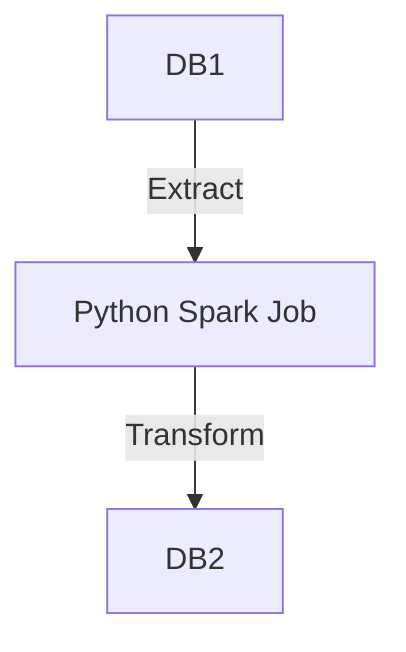

# Toy Pipeline

It's a toy project just to showcase my data engineering skills. Here's an overview of the project:



## How to run

### Set environment variables

You need to set all environment variables in order to reuse this information all across the project. Create a file called `.env` and copy the following values into it.

```plaintext
DB1_HOST=localhost
DB1_PORT=5432
DB1_USER=user1
DB1_PASSWORD=password1
DB1_NAME=db1
DB2_HOST=localhost
DB2_PORT=6543
DB2_USER=user2
DB2_PASSWORD=password2
DB2_NAME=db2
```

### Put both databases up and running

You need to have Docker and Docker compose installed. Then, you get both databases running by running the following command:

```bash
docker compose up
```

You can stop both databases by typing CTRL+C. Alternatively you can use the `-d` option to detach. In this case you'll need to stop both databases using `docker compose down`.

### Create your Python environment

Now create your Python virtual environment using:

```bash
python -m venv .venv
source .venv/bin/activate
```

And then install all necessary dependencies using:

```bash
pip install -r requirements.txt
```

### Mock data

To mock all the data of the DB1 you can just use `make mock`.

### Run the job

To run the job is very simple. Here's the command.

```
python job.py
```

Note: Make sure you are inside your Python environment.